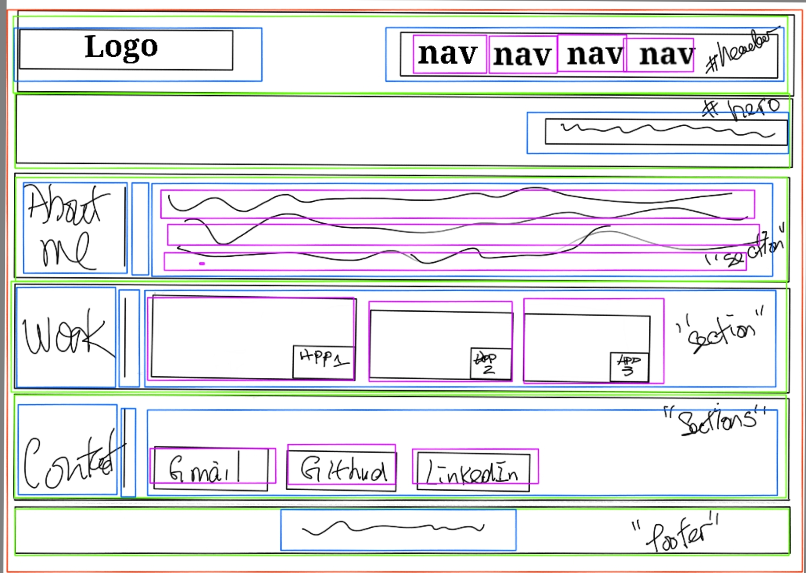
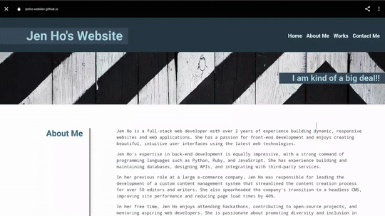

# Personal Portfolio

  Develop a portfolio website that showcase my skills and talents to potential employer.

- [Explore the docs]( https://github.com/jenho-webdev/Personal-Portfolio)

- [Deployed Application](https://jenho-webdev.github.io/Personal-Portfolio/)

- [Report Bug](https://github.com/jenho-webdev/Personal-Portfolio/issues/)

- [Request Feature](https://github.com/jenho-webdev/Personal-Portfolio/issues)

<!-- TABLE OF CONTENTS -->

## Table of Contents

- [About The Project](#about-the-project)

- [User Story](#user-story)

- [Acceptance Criteria](#acceptance-criteria)

- [Mock-up](#mock-up)

- [Roadmap](#roadmap)

- [Contact](#contact-me)

- [Acknowledgments](#acknowledgments)

## About The Project

Develop a portfolio website that showcase my skills and talents to potential employer.

## User Story

    AS AN employer
    I WANT to view a potential employee's deployed portfolio of work samples
    SO THAT I can review samples of their work and assess whether they're a good candidate for an open position

## Acceptance Criteria

Here are the critical requirements necessary to develop a portfolio that satisfies a typical hiring manager’s needs:

    GIVEN I need to sample a potential employee's previous work
    WHEN I load their portfolio
    [x] THEN I am presented with the developer's name, a recent photo or avatar, and links to sections about them, their work, and how to contact them
    
    WHEN I click one of the links in the navigation
    [x] THEN the UI scrolls to the corresponding section
    
    WHEN I click on the link to the section about their work
    [x] THEN the UI scrolls to a section with titled images of the developer's applications
    
    WHEN I am presented with the developer's first application
    [x] THEN that application's image should be larger in size than the others
    
    WHEN I click on the images of the applications
    [x] THEN I am taken to that deployed application
    
    WHEN I resize the page or view the site on various screens and devices
    [x] THEN I am presented with a responsive layout that adapts to my viewport

## Mock-Up

The following animation shows the web application's appearance and functionality:

### Wireframe

### Mock-up Demo

<!-- ROADMAP -->
## Roadmap

- [x] Site Baseline development: A functional and responsive site showing the latest web applications that i built.
- [ ] Adding some kind of Javascript function to the site for better user experience.
See the [open issues](https://github.com/jenho-webdev/Personal-Portfolio/issues) for a full list of proposed features (and known issues).

## Contact Me

[![LinkedIn][linkedin-shield]](https://www.linkedin.com/in/jen-h-202a1723/)
[![Github][Github-shield]](https://github.com/jenho-webdev/Personal-Portfolio)
[![Slack][slack-shield]](https://jenworkspace-as73396.slack.com/archives/C052QLTJQHG)

## Acknowledgments

- Shield and badges used in this markdown document were sourced from [Shields.io](https://shields.io/).
<!-- MARKDOWN LINKS & IMAGES -->
<!-- https://www.markdownguide.org/basic-syntax/#reference-style-links -->
[linkedin-shield]: https://img.shields.io/badge/-LinkedIn-black.svg?style=for-the-badge&logo=linkedin&colorB=555
[linkedin-url]: https://linkedin.com/in/linkedin_username
[Github-shield]:https://img.shields.io/badge/GitHub-100000?style=for-the-badge&logo=github&logoColor=white
[slack-shield]:https://img.shields.io/badge/Slack-4A154B?style=for-the-badge&logo=slack&logoColor=white
